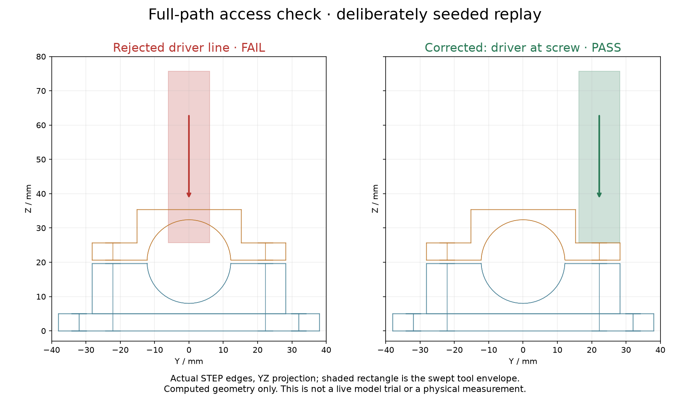

# The fixture has to leave room for the wrench

Unpublished draft; canonical editorial copy is in website-drafts/_drafts/fixtureforge.md.

I asked Codex to build a small engineering tool around a fairly ordinary question:
can the tool actually reach the screw? A hole can have the correct diameter and
still be inconveniently located behind something solid. FixtureForge gives that
question an explicit geometric contract, using a sensor clamp as the example.

The first useful result was a reason to make the project smaller. CADCLAW already
checks STEP assemblies, and CadQuery and build123d already provide the geometry
operations. There was no reason to write another CAD kernel or call this a new
general-purpose CAD validator. I directed the requirements and asked the agent
to compare those tools before implementing anything substantial.

The comparison used two deliberately simple cases: a cylindrical screw-tool
envelope and a box representing a connector. Each could sit at either endpoint
without touching an obstacle. Moving between those endpoints passed through
4 cubic millimeters of solid material. CadQuery and build123d agreed on that
intersection, and CADCLAW found it when supplied with the complete swept solid.
The missing piece in the reviewed workflow was declaring and constructing that
path, then carrying its assumptions into a repeatable report.

FixtureForge therefore became a small integration. An engineer supplies STEP
parts and JSON describing the tool or connector, its start and end positions,
which parts are present, and any intended final contact. The checker constructs
the entire swept envelope. It does not decide clearance by looking at a few
animation frames. A thin obstacle between frames is still an obstacle, however
smoothly the animation plays.

The restriction is deliberate. Paths are straight translations, orientations
stay fixed, and envelopes are axis-aligned boxes or cylinders. Some nonaxial
sweeps use enclosing boxes, which can report an obstruction that a more precise
tool shape would avoid. The report identifies that conservatism. Curved motion,
articulated wrenches, and flexible cables remain outside the contract.



*Actual edges from the exported and reimported STEP model. The shaded regions
show the complete tool envelope. This is a deliberately seeded replay, not a
live model response or a photograph of a manufactured fixture.*

The replay gives the checker an intentionally bad driver line through the middle
of the upper clamp. The report names the blocked path and the obstructing part.
Moving the line back to the screw center clears it. Both versions remain in the
output directory, so a green result does not erase the example that failed.

The acceptance suite also includes less theatrical defects: too little wall
material, an impossible mounting pitch, a blocked connector, a screw-head
collision, an inaccessible tool, joined halves, an empty solid, and an oversized
part. During review, the agent refined two mutations to isolate their intended
failure more carefully. The earlier results remain in the evidence directory.
One test also needed a numerical correction: a computed volume of
3.999999999999999 should be compared with a tolerance, not exact equality.

I wanted the measurements to come from the exported object. The independent
checks reimport STEP and inspect cylinder surfaces, hole axes, planes, bounds,
and solid validity. The software checks STL watertightness and orientation too,
but does not use a triangle mesh as the only dimensional oracle. The six
reference sensor sizes pass the current checks. That is evidence about this
restricted software contract, not a certificate for anything I might print.

The separate consumer walkthrough mattered just as much as the bundled clamp.
In a fresh environment outside the source checkout, the agent installed the
wheel, configured an independently scripted bracket, obtained the expected
failure, and corrected it without editing package source. It also built a
non-default 18 mm fixture twice with identical inspection results. This was an
agent-executed exercise; an independent engineer using their own assembly would
be stronger evidence of usefulness.

The reproducible entry point, after the README's local installation steps, is:

```powershell
python -m fixtureforge demo --offline --output artifacts/my-demo
```

The reports, failed inputs, test output, and requirement mapping are retained in
the project. The draft's publication checklist still needs a verified public
repository URL and hosted evidence links; I have not substituted a proposed URL
for a working destination.

There are practical limits beyond the path model. The sample needs underside
space for nuts and a stated assembly order. No sensor has been clamped in a
printed part, and no force, strength, fatigue, or print-quality measurements have
been made. No paid model API was used and no live generation trial was run.
Codex implemented the deterministic tool under the written requirements. The
result is useful to inspect and challenge locally, while the physical fixture
and its usefulness to other engineers still need their own tests.
